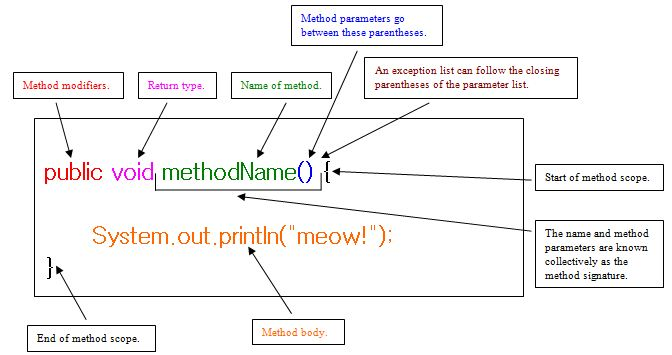
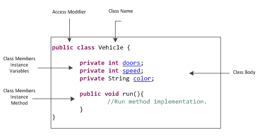
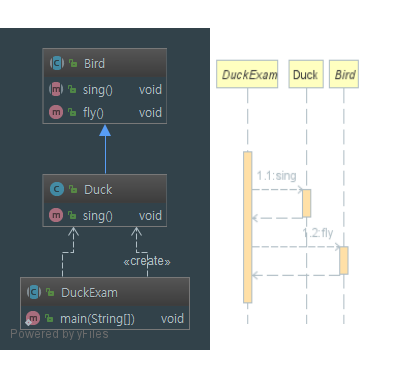

[TOC]


# JAVA

## Terms

### Java Statement

#### - If

```java
if (expression) {
    statements;
  } else if (expression) {
    statements;
  }

```


#### - while loop

```java
while (expression) {
  statements;
}
```


#### - Do-While Loop

```java
do {
  statements;
} while (expression)
```


#### - For loop

```java
for (condition) {
  statements;
}
```


#### - for Each loop

```java
for (type var : iterate) {
  statements;
}
```


#### - Switch

```java
switch (expression) {
  case value:
    statements
      break;
  case value2:
    statements
      break;
  default:
    statements
}
```

```java
switch (employee) {
    case "사원":
        msg = "말단입니다";
        break;
    case "대리":
    case "과장":
        msg = "집에 못가져";
        break;
    default:
        System.out.println("그외");
}
System.out.println(msg);

// switch 쓸 때, 출력을 위한 변수 선언을 꼭 해줄 것.
```


### Java data Conversions

#### - String to Number

```java
int i = Integer.parseInt(str);
Double d = Double.parseDouble(str);
```

#### - Any type to String

```java
String s = String.valueOf(value);
```


### java.util.ArrayList Methods

`.add(itm)` Add item to list.

`.get()` Return Item.

`.size()` Return number of items.

`.remove()` Remove item.

`ArrayList <String> names = new ArrayList<String>();`


### Declaring - 선언

#### Method




#### Static method


### Declaring member Variables - 변수 선언

> Const 앞에 쓰이는 변수는 접근지정자를 써줄 것

```java
{
  private String name;
  
  private  = Access Modifiers
  String   = Field type
  name     = Field name
}
```





## Number

> **큰 숫자** 를 저장하기 위해서는 bigdecimal 을 쓴다.

```java
BigDecimal d1 = new Bigdecimal("2.0");
BigDecimal d2 = new Bigdecimal("4.1");
System.out.println(d1.subtract(d2));
```

#### 사칙 연산 - the Four fundamental arithmetic

- a.add
- a.subtract
- a.multiply
- a.divide
- a.mod

```java
BigInteger big = new BigInteger("10");
System.out.println(big);
// 10
```

- 비교: `a.compareTo(b)`
- 같은지 비교: `a.equals(b)` - true,false 반환
- min: `a.min(b)`, max: `a.max(b)`
- 숫자로 변환: `b.doubleValue()`, `b.floatValue()`, `b.intValue()`, `b.longValue()`
- String: `b.toString()`
- 절대값: `b.abs()`
- n승: `b.pow(n)`
- divide 소수 첫째자리에서 올림 ROUND_UP, ROUND_DOWN, ROUND_FLOOR 등등.


## switch, for, if, while, Do-while, for each


## Abstract and Interface

### abstract


* 추상 메소드가 하나 이상 포함되면 **반드시** 추상 클래스로 선언되야 한다.

* 추상 클래스를 상속하는 자식 클래스에서는 부모가 가진 추상 메소드를 모두 override 해야한다.

* 추상화클래스가 부모가 되고, 미완성된 부분을 자식 클래스에서 상속받은 후 완성시켜 사용한다.

* 몸체따윈 없고 걍 선언부만 있다. ( 내용이 없음 ) 

* 추상을 받는 클래스는 abstract를 써준다.

* extends 로 상속 받는다. ( class Dog extends Animal )

* 객체를 만들수 없다. ( Figure f1 = new Figure(); ) 이런거 안됨.

  

  #### - Structure

  ```java
  public abstract class 클래스명 {
    ...
      public abstract void 메소드명():
    
    	[접근제한자] abstract [return 자료형] [method 이름] (매개변수);
  }
  ```

  

  ```java
  package prac;
  
  public abstract class Bird {    // 2. 여기도 abstract 를 써줘야 한다.
      public abstract void sing();    // 1. abstract method 가 들어갈땐,
  
      public void fly() {         // 3. 일반 method 도 들어갈 수 있다.
          System.out.println("날다.");
      }
  }
  ```

  ```java
  package prac;
  
  public class Duck extends Bird {	// 4. Birds를 상속했기 때문에,
  
      @Override       // 5. Bird 에서 만들었던 sing 을 override 한다.
      public void sing() {
          System.out.println("꽥꽥!!!");
      }
  }
  
  ```

  ```java
  package prac;
  
  public class DuckExam {
      public static void main(String[] args) {
          Duck duck = new Duck(); // 1. duck 의 인스턴스.
  
          duck.sing();    // 2. abstract method 실행.
          duck.fly();     // 3. 같이 있던 fly 도 같이 쓸 수 있다.
      }
  }
  ```

  ```console
  꽥꽥!!!
  날다.
  ```

  

  #### - purpose of Use

* 공통되는 기능[함수]이 필요하지만, 어느 부분이 자식 클래스에서 달라질 경우 사용한다. ( 상속의 기본 개념과 유사함 )
* 여러명의 자식 클래스에서 공통으로 수행되는 부분은 추상화 클래스에서 완성을 해주고 나머지 자식 클래스마다 개별적으로 동작해야 하는 부분만 추상화 메소드로 선언하여 이를 자식 클래스에서 강제적으로 완성.
* 부모 클래스로 직접 객체 생성을 해야 하는 이유가 없는 경우.


 


## Array

> arr[] 의 [] 안에 1,3,-2,4 가 들어간다.

```java
int arr[] = {1,3,-2,4};

double sum = 0;
for ( int i = 0; i < arr.length; i++) { 
	sout(arr[i]+" ");
  sum += arr[i];
}
// 1,3,-2,4
```


## getter() setter()

> 클래스 내에서 `private` 로 설정된 변수값을 다른 클래스에서 사용하기 위해 사용됨. 

```java
class Student() {
  private String name;
  private int age = 10;
  
  // 멤버 변수에 값을 넣는 방법.
  public void setName(String name) {
    this.name = name;
  }
  publiv void setAge(int age) {
    this.age = age;
  }
  
  /*
  std.setName("홍길동)의 홍길동을 (String name) 으로 가져와서 name 에 넣고,
  this.name 으로 private 에 접근함. < this 사용의 이유 >  
  private name 은 평소 못쓰다가 getName 할 때 public 이기 때문에 가져다 쓸 수 있음.
  */
  
  public String getName() {
    return name;
  }
  public int getAge() {
    return age;
  }  
}
```

```java
public static void main(String[] args) {
  
  Student std = new Student();
  std.setName("홍길동");
  std.setAge(40);
  System.out.println("이름과 나이는 " + std.getAge() + std.getName());
  
  // 이름과 나이는 20 40
  
}
```


## JFrame

### - Outline


```java
public class MyExam extends JFrame implements ActionListener {
  
  public MyExam() {
    // const
  }
  
  @Override
  public void actionPerformed(ActionEvent e) {
    
  }  
  
  public static void main(String[] args) {
    new MyExam(); // executable.
  }
}
```


#### - Const

```java
public MyExam() {
  
  super("Ex_notePad");	// (title)
  
  initLayout();	// method.
  
  setBounds(x: ,y: ,width: ,height: );	// int.
  setBackground(Color.red);	// Color.
  setVisible(true);
  
  // event exit(0);
  addWindowListener(new WindowAdapter()) {
    @Override
    public void windowClosing(WindowEvent e) {
      int re = JOptionPane.showconfirmDialog(Ex_notePad.this, "종료?", "종료", JOptionpane.YES_NO_CANCEL_OPTION);
      if (re == JOptionPane.YES_NO_CANCEL_OPTION) {
        setDefaultCloseOperation(DO_NOTHING_ON_CLOSE);
      }	else {
        setDefaultCloseOperation(JFrame.EXIT_ON_CLOSE);
      }
    }
  }
  // addWindowListener;
  
}
// MyExam();
```


#### - Button, TextArea, PopupMenu, MenuItem, Panel


> 기본적으로 모든 Button 과 TextArea, PopupMenu, MenuItem, Panel 은 __전역변수__로 쓴다.

```java
// define Button.
Jbutton btnCopy = new JButton("Copy");

// define Panel.
JPanel panel_1 = new Jpanel();

// define TextArea.
JTextArea txtMemo = new JTextArea("");

// define JMenuItem.
JMenuItem mnEx_1, mnEx_2, mnEx_3;
```


#### - Panel

> Panel 패널명 = new Panel();
> 패널명.setLayout(new xxxLayout(행, 열));
> 패널명.setBorder(Borderfactory.createEmptyBorder(30,30,10,30)); -> 패널의 여백!
> 패널명.add("동서남북", 버튼명이나 레이블, 텍스트 에어리어 이름);

```java
Panel pn_1 = new Panel();
pn_1.setLayout(GridLayout(3,5));
pn_1.add("West", )
```


#### - Layout[^1]

##### 1. Card Layout

> CardLayout 객체1 = new Cardlayout();
> 패널이름.setLayout(객체1);
> 패널이름.add(카드레이아웃이름, 패널명2);	-> 패널명2를 카드레이아웃으로 설정.
> add(패널명1);	-> 프레임에 카드 추가.
> 객체1.show(패널명1, 카드레이아웃명);	-> 다음 카드레이아웃을 보여줌.

```java
// layout
CardLayout cd_1 = new CardLayout();
// panel
JPanel pn_1 = new JPanel();
jPanel pn_2 = new JPanel();


public myLayout() {
  
  makeLayout();	// method.
  
  setBounds(x,x,x,x);
  setVisible(true);  
  
}

public void makeLayout() {
  
}
```


##### 2. GridLayout

> setLayout(new GridLayout(행, 열));
> 패널명2.add(추가기능);
> 패널명2.setBackground(Color.red);

```java
public myLayout() {
  setLayout(new GridLayout(5,2));
  pn_2.add();
}
```


##### 3. BorderLayout

> setLayout(new BorderLayout(행, 열));
> 패널명.add();
> 패널명.setBackground(Color.red);


# JAVA Beans


---

[^1]: http://itpangpang.xyz/192 Layout 스타일 참고.

