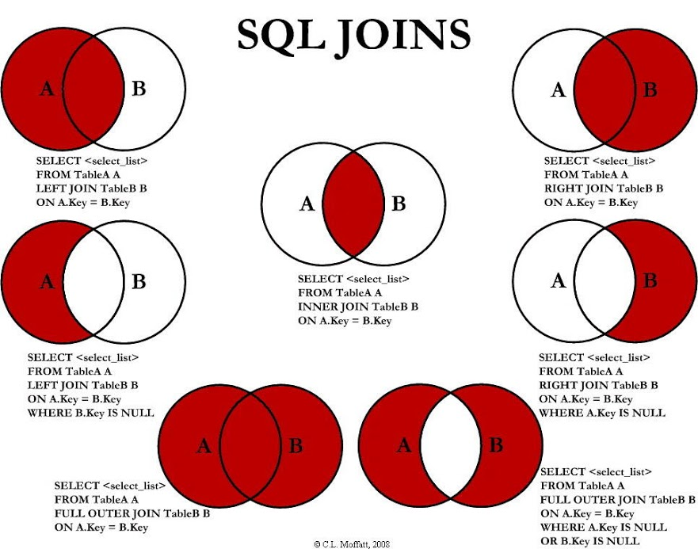

[TOC]

## Type of SQL


|      | DDL                                         | DML                                           | DCL                                      |
| ---- | ------------------------------------------- | --------------------------------------------- | ---------------------------------------- |
|      | Data Definition Language<br />데이터 정의어 | Data Manipulation Language<br />데이터 조작어 | Data Control Language<br />데이터 제어어 |
|      | CREATE<br />ALTER<br />DROP<br />TRUNCATE   | SELECT<br />INSERT<br />UPDATE<br />DELETE    | GRANT<br />REVOKE                        |


### DDL

> 데이터베이스를 정의하는 언어. 데이터 생성 및 수정, 삭제.
> **DROP**은 테이블 삭제, **DELETE**는 값을 삭제하지만 `COMMIT` 과 `ROLLBACK` 이 가능함. **TRUNCATE**도 삭제는 가능하지만 자동 `COMMIT` 이라서 `ROLLBACK` 불가능.

|            |                                         |
| ---------- | --------------------------------------- |
| `CREATE`   | 데이터베이스, 테이블 등을 생성하는 역할 |
| `ALTER`    | 테이블을 수정하는 역할                  |
| `DROP`     | 데이터베이스, 테이블을 삭제하는 역할    |
| `TRUNCATE` | 테이블을 초기화 시키는 역할             |

* SCHEMA, DOMAIN, TABLE, VIEW, INDEX 를 정의하거나 변경할때 사용함.
* 데이터베이스 관리자나 데이터베이스 설계자가 사용.


### DML

> 데이터 조작어, 정의된 데이터베이스에 입력된 레코드를 **조회**하거나 **수정** 및 **삭제** 하는 역할. 

|          |                        |
| -------- | ---------------------- |
| `SELECT` | 데이터를 조회하는 역할 |
| `INSERT` | 데이터를 삽입하는 역할 |
| `UPDATE` | 데이터를 수정하는 역할 |
| `DELETE` | 데이터를 삭제하는 역할 |

* 데이터베이스 사용자가 조작어를 통해 실질적 데이터를 처리하는데 사용.
* 데이터베이스 사용자와 관리 시스템간의 인터페이스 제공.


### DCL

> 데이터베이스에 접근하거나 객체에 권란을 주는 등의 역할.

|            |                                                              |
| ---------- | ------------------------------------------------------------ |
| `GRANT`    | 특정 데이터베이스 사용자에게 특정 작업에 대한 수행권한 부여  |
| `REVOKE`   | 특정 데이터베이스 사용자에게 특정 작업에 대한 수행 권한을 박탈 및 회수 |
| `COMMIT`   | 트랜잭션의 작업이 정상적으로 완료됐음을 관리자에게 알림      |
| `ROLLBACK` | 트랜잭션의 작업이 비정상적으로 종료 되었을 때 원래대로 복구  |


## Terms

|                                                              |                                                 |
| ------------------------------------------------------------ | ----------------------------------------------- |
| `CREATE TABLE TABLE_NAME(var PRIMARY KEY, var VARCHAR2(N));` |                                                 |
| `INSERT INTO TABLE_NAME(var1, var2, var3). . .`              |                                                 |
|                                                              |                                                 |
| `DROP TABLE TABLE_NAME;`                                     | 테이블 삭제                                     |
| `DELETE FROM TABLE_NAME var;`                                | 값 삭제. `COMMIT` `ROLLBACK`                    |
| `TRUNCATE TABLE TABLE_NAME`                                  |                                                 |
| `DESC TABLE_NAME`                                            | 테이블 확인                                     |
|                                                              |                                                 |
| `QUIT`                                                       | `QUIT`로 빠질 땐 무조건 `COMMIT`된 상태로 빠짐. |
| `COMMIT`                                                     |                                                 |
| `ROLLBACK`                                                   | 클라이언트에서 작업한 모든 것들이 취소          |
| `UPDATE TABLE_NAME SET (var) = ;`                            | 모든 자료 수정                                  |


## CONSTRAINT 제약조건

> 잘못된 자료의 입력을 막기 위한 제약 조건.

1. 기본키 제약 조건.

   ```MARKDOWN
   중복을 허용하지 않는 칼럼에 대해 PRIMARY KEY 설정.
   중복자료 입력 불가. NOT NULL, INDEX 생성.
   ```

2. 사용자 정의 제약 조건

   ```markdown
   	CHECK, UNIQUE, FOREIGN KEY . . . 
   ```


### NOT NULL

> '필수 입력 사항'을 의미함.

- NOT NULL은 INSERT 시, **데이터 입력시에 누락이 되어서는 안되는 부분**을 의미.
- NOT NULL 값이 기본값이므로, 컬럼2와 3은 동일하다.

```SQL
CREATE TABLE 테이블명
(
	컬럼명1 테이터타입 NOT NULL,
  컬럼명2 데이터타입 NULL,
  컬럼명3 데이터타입
);
```

```SQL
CREATE TABLE buser
(
	buser_no NUMBER(4) PRIMARY KEY,
 	buser_name VARCHAR(10) NOT NULL
);
```


### UNIQUE

> UNIQUE 는 **해당 테이블에 있어서 존재하는 값이 유일**해야 한다.

- PRIMARY KEY 와 비슷하지만 UNIQUE 의 경우 하나의 테이블에 여러개를 정의할 수 있다.
- UNIQUE 의 경우 NULL 값이 허용된다.
- PRIMARY KEY 처럼 바뀌지 않는 다른 값들을 사용하고 싶을때 사용.

```SQL
-- 단일 UNIQUE 조건

CREATE TABLE 테이블명
(
	컬럼명1 데이터타입 UNIQUE,
  컬럼명2 데이터타입
);

-- 복수 UNIQUE 조건

CREATE TABLE 테이블명
(
	컬럼명1 데이터타입 UNIQUE,
  컬럼명2 데이터타입,
  컬럼명3 데이터타입 UNIQUE,
  컬럼명4 데이터타입,
);
```


### PRIMARY KEY

> 기본키는 하나의 테이블에 있는 데이터들을 식별하기 위한 기준으로 인식되는 제약조건이다.

- 한개의 테이블에 하나만 생성 가능하다.
- NOT NULL + UNIQUE 의 2개의 속성을 기본적으로 가진다.

  

```SQL
CREATE TABLE 테이블명
(
	컬럼명1 데이터타입 PRIMARY KEY,
  컬럼명2 데이터타입
);
```

```SQL
CREATE TABLE my_family
(
	code NUMBER(4) PRIMARY KEY,
  gname VARVHAR2(10),
  birth DATE
);
```


### FOREIGN KEY

> 해당 컬럼에 참조하는 테이블로부터 존재하는 값들만 사용한다는 의미의 제약조건이다.

- 여러개의 컬럼에 **중복적으로 적용 가능**하다.
- 부모테이블과 자식테이블로 관계를 맺고 있을 시, **자식테이블이 참조하는 데이터는 부모 테이블에서 삭제가 불가**하다. (자식테이블부터 삭제 후 부모테이블 삭제 가능)

```SQL
CREATE TABLE 테이블명
(
	컬럼명1 데이터타입 REFERENCES 참조할테이블명(참조할테이블명의 칼럼명),
  컬럼명2 데이터타입
);
```

```SQL
CREATE TABLE student 
( 
  std_number NUMBER(4) PRIMARY KEY, 
  std_name   VARCHAR2(30) NOT NULL, 
  sub_name   NUMBER(4) REFERENCES lecture(lec_code), 
  std_grade  NUMBER DEFAULT 1 CHECK ( 1 <= std_grade AND std_grade >= 4) 
); 
```

#### PRIMARY KEY - FOREIGN KEY

- [PRIMARY KEY - FOREIGN KEY EXAMPLE](PRIMARY KEY - FOREIGN KEY.md )

### CHECK

> 조건에 부합하는 데이터만 입력이 가능하도록 하는 제약조건이다.

- 기본연산자나 비교연산자, IN, NOT IN 등등 사용 가능하다.

```SQL
CREATE TABLE 테이블명
(
	컬럼명1 데이터타입 CHECK (조건),
  컬럼명2 데이터타입
);
```

```sql
CREATE TABLE prof
(
	prof_code NUMBER PRIMARY KEY,
  prof_name VARCHAR2(30),
  prof_labo NUMBER CHECK(100 <= prof_labo AND prof_labo <= 500)
);
```


## DDL

### CREATE


### ALTER


### DROP


### TRUNCATE


## DML

> 어디에서(WHERE), 어떤 데이터(WHAT) 를 가져올 것인지로 구분되는데, '어디에서 (테이블 혹은 뷰에서)' 에 해당하는 내용을 FROM 절에서, '어떤 데이터' 에 해당하는 내용을 SELECT 에서 기술해 준다.
> 그리고 '어떤 데이터' 는 다시 어떠한 조건에 맞는 데이터인지를 식별해야 하는데, 이 조건을 기술하는 부분이 WHERE 절. 

### SELECT

> 데이터베이스 안에 있는 데이터를 조회하기 위해서 사용한다.

```SQL
SELECT 컬럼명1, 컬럼명2, ...
FROM 테이블명
WHERE 조건
ORDER BY 컬럼명;
```

```SQL
SELECT select_list [ INTO new_table ]
[ FROM table_source ]	[ WHERE search_condition ]
[ GROUP BY group_by_expression ]
[ HAVING search_condition ]
[ ORDER BY order_expression [ ASC | DESC ] ]
```


- 단독으로는 절대 사용될 수 없다. 필수로 FROM 이 따라오며, 그외 조건(WHERE) 이나 기타 다른 키워드를 사용할 수 있다.


```SQL
SELECT	*
FROM		JIKWON;		-- JIKWON 테이블 조회

SELECT	JIKWON_NO,
				JIKWON_NAME
FROM		JIKWON;		-- JIKWON 테이블의 NO 와 NAME 조회.


SELECT	JIKWON_NO		AS 사번,
				JIKWON_NAME	AS 직원명
FROM		JIKWON;		-- JIKWON_NO 와 NAME 에 별명 부여.

SELECT	JIKWON_NO 	사번,
				JIKWON_NAME 직원명
FROM		JIKWON;		-- 상동


SELECT	JIKWON_NO
				|| JIKWON_NAME
FROM		JIKWON;		-- 연결연산자 사용 가능.

SELECT	JIKWON_NO
				|| JIKWON_NAME	AS 자료
FROM		JIKWON;		-- 연결연산자 + 별명.

SELECT	10,
				'안녕',
				12 / 3
FROM		DUAL;		-- DUMMY TABLE.

SELECT	JIKWON_NO,
				JIKWON_NAME,
				JIKWON_PAY
FROM		JIKWON;		-- 3개 가능

SELECT	JIKWON_NO,
				JIKWON_NAME,
				JIKWON_PAY
				* 0.012	AS TAX
FROM		JIKWON;		-- 연산 후 불러내기 가능. (PAY*0.012) NO,NAME,TAX 3가지 출력.

SELECT	JIKWON_NAME
				|| '님'
FROM		JIKWON;		-- 문자열도 연산 가능.

```


### INSERT

> 신규로 데이터를 입력할 때 사용함.
>
> 기본형태, 컬럼명 생략 형태, INSER ~ SELECT 형태로 나눌 수 있다.

```sql
INSERT INTO 테이블명 ( 컬럼1, 컬럼2, . . .)
VALUES ( 값1, 값2, 값3, . . .)
```

> `VALUES` 에 나오는 값의 수와 순서, 데이터 타입이 일치해야만 한다. 그렇지 않으면 입력 안됨.
>
>  SQL 오류 : ORA-00932 : 일관성 없는 데이터 유형

```SQL
-- 1. 기본형

CREATE TABLE ex_1 
      (
		    col1 VARCHAR2(10),
       	col2 NUMBER,
        col3 date
      );
      -- 테이블 생성및 컬럼과 컬럼의 TYPE 지정.
    
INSERT INTO ex_1
      (
         col1, col2, col3
      )
VALUES
      (
				'ABC', 10, SYSDATE
      );
      
      
-- 2. 컬럼명 생략 형태 (많이씀)
INSERT INTO ex_1 VALUES ('DEF', 20, SYSDATE);
-- 테이블에 있는 컬럼의 타입에 맞추지 않으면 애러 발생.


```


### UPDATE


### DELETE


### WHERE

> 1. 검색 조건을 지정하는 SQL 절.
> 2. 조건에 맞는 레코드만 선별함.
> 3. column 에 포함 안되는 단지 *조건*만 씀.

```sql
SELECT	column_1, column_2, . . .
FROM		table_name
WHERE		condition;
```


## SQL Logical Operators 논리 연산자.

### 1. BETWEEN

```sql
SELECT	컬럼명_1, 컬럼명_2, . . .
FROM		테이블명
WHERE		칼럼명 BETWEEN 칼럼변수 AND 칼럼변수;
```

### 2. IN

```sql
SELECT	컬럼명_1, 컬럼명_2, . . .
FROM		테이블명
WHERE		칼럼명 IN ( '칼럼변수','칼럼변수' );
-- OR 을 계속 쓴것과 같은 효과를 가짐.
```

### 3. LIKE

> - % 는 임의의 문자열(String), _ 는 임의의 문자(Char).
> - 칼럼 내용이 특정 패턴에 맞는지 필터링 할때 사용함.
> - 값의 일부가 일치하는 경우에도 사용함.

```sql
SELECT	컬럼명_1, 컬럼명_2, . . .
FROM		테이블명
WHERE		칼럼명	LIKE '이%'	OR 
			  칼럼명 LIKE '김_'; 
```

`'이%' 는 이~ 이후의 글자를 뽑음`

`'%이%' 는 ~이~ 이를 기준으로 앞과 뒤의 글자 모두 포함`

`'김_' 는 김x 를 뽑음. '김__' 는 김xx 를 뽑음.`

### 4. WHERE - IS NULL, IS NOT NULL

> NULL 값을 찾으려면 IS NULL, NULL 값을 제외한 값을 보려면 IS NOT NULL.

```sql
SELECT	컬럼명_1, 컬럼명_2, . . .
FROM		테이블명
WHERE		칼럼명 IS(NOT) NULL;
```

### 5. NOT

> 조건 이외의 모든 값 출력

```sql
SELECT	칼럼명_1
FROM		테이블명
WHERE		NOT 조건;

SELECT	*
FROM		Customers
WHERE		NOT Country = 'Germany';
-- Country가 'Germany'가 아닌 Customers 의 모든 필드 선택.
```

### 6. AND

> AND 로 구분 된 **모든 조건**이 TRUE 이면 조건 출력.

```sql
SELECT	칼럼명_1
FROM		테이블명
WHERE		조건1 AND 조건2 AND 조건3 . . .;

SELECT * FROM Customers
WHERE Country='Germany' AND City='Berlin';
-- Country 가 Germany 이고 도시가 Berlin 인 Customers 출력.
```

### 7. OR

> OR 로 구분 된 **조건**이 TRUE 이면 조건 출력.

```sql
SELECT	칼럼명_1
FROM		테이블명
WHERE		조건1 OR 조건2 OR 조건3 . . .;

SELECT * FROM Customers
WHERE City='Berlin' OR City='München';
-- 도시가 Berlin 또는 Munchen 인 Customers 의 모든 필드 선택.
```

### 8. 예시들.

```sql
SELECT * FROM Customers
WHERE country = 'Germany' AND (city = 'Berlin' OR city = Munchen);
-- country가 "Germany"이고 도시가 "Berlin"또는 "München"(복잡한 표현식을 형성하기 위해 괄호를 사용해야 함) 인 "Customers"의 모든 필드를 선택
```

```sql
SELECT * FROM Customers
WHERE NOT country = 'Germany' AND NOT country = 'USA';
-- country가 "Germany"가 아니며 "USA"가 아닌 "Customers"의 모든 필드를 선택
```

```SQL
SELECT * 
FROM   jikwon 
WHERE  jikwon_jik = '대리';		-- 대리만 출력

SELECT * 
FROM   jikwon 
WHERE  jikwon_no = 3;		-- 3번에 해당하는 과장만 출력

SELECT * 
FROM   jikwon 
WHERE  jikwon_ibsail = '2011-03-03';		-- 입사일 11년3월3일인 사람 출력

SELECT * 
FROM   jikwon 
WHERE  jikwon_ibsail = '2011/03/03';		-- 상동

SELECT * 
FROM   jikwon 
WHERE  jikwon_no = 3
				OR jikwon_no = 5;			-- 직원넘버 3번,5번 출력
				
SELECT * 
FROM   jikwon 
WHERE  jikwon_jik = '사원'
				AND jikwon_gen = '여'
				AND jikwon_pay <= 3000;		-- 사원이면서 여자이면서 연봉3천 이하 출력
				
SELECT * 
FROM   jikwon 
WHERE  jikwon_no >= 5
				OR jikwon_no =< 10;			-- 직원넘버 5번에서 10번 사이 출력
				
SELECT *
FROM	 jikwon 
WHERE	 jikwon_ibsail 
				BETWEEN '2001-1-1' 
				AND '2005-12-31';			-- 2001-1-1 에서 2005-12-31 사이 입사한사람 출력
				
SELECT * 
FROM 	 jikwon 
WHERE  jikwon_no < 5 
				OR jikwon_no > 10;		-- 5 미만 10 초과애들만 나옴.
				
SELECT * 
FROM   jikwon 
WHERE  NOT (jikwon_no < 5 OR jikwon_no > 10);		-- 5 미만 10 초과애들.
				
SELECT * 
FROM 	 jikwon 
WHERE  jikwon_no BETWEEN 5 AND 10;		-- 5와 10 사이 직원 출력.				
				
SELECT * 
FROM 	 jikwon 
WHERE  jikwon_gen = '남';		-- 남자만 출력

SELECT * 
FROM 	 jikwon 
WHERE  jikwon_gen <> '남';		-- 여자만 출력

SELECT * 
FROM 	 jikwon 
WHERE  jikwon_name = '홍길동';		-- 홍길동 출력

SELECT * 
FROM 	 jikwon 
WHERE  jikwon_name = '홍';			-- 모든 홍 출력

SELECT * 
FROM 	 jikwon 
WHERE  jikwon_name = '김'
				AND jikwon_name <= '최';		-- 김씨와 최씨 출력
				
SELECT * 
FROM 	 jikwon 
WHERE  jikwon_name = '김' BETWEEN '김' AND '최';		-- 상동
				
SELECT * 
FROM 	 buser 
WHERE  buser_name IN ('총무부','전산부');		-- 총무부,전산부 출력

SELECT * 
FROM 	 jikwon 
WHERE  jikwon_jik IN ('대리','과장','부장');	-- 대리 과장 부장 출력

SELECT * 
FROM 	 jikwon 
WHERE  buser_num IN ('10','30')
				ORDER BY buser_num ASC;	-- 부서넘버가 10과 30인 모든애들 출력
```


## SQL Comparison Operators 비교 연산자

| 연산자 |          설명           |
| :----: | :---------------------: |
|   =    |          같음           |
|   !=   |        같지 않음        |
|   <>   |        같지 않음        |
|   <    |          작음           |
|   >    |           큼            |
|   <=   |       작거나 같음       |
|   >=   |       크거나 같음       |
|   !<   | 작지 않음 (>= 대체가능) |
|   !>   | 크지 않음 (<= 대체가능) |


## SQL SUM(), AVG(), COUNT()

http://keep-cool.tistory.com/37

http://loveiskey.tistory.com/60

http://dinggur.tistory.com/101

https://www.w3schools.com/sql/sql_quickref.asp


## CASE - WHEN

```sql
case 표현식 
	when 결과1 then
				처리문1;
  when 결과2 then
				처리문2;
	...
	else
			기타 처리문;
end case;
```

```sql
case when 표현식1 then
			처리문1;
		when 표현식2 then
			처리문2;
		...
		else
			기타 처리문;
end case;
```


## JOIN





### INNER JOIN

> 

```sql
SELECT	column_name(s)
FROM		table_1
	INNER JOIN table_2 ON table_1.column_name = table_2.column_name;
```


### LEFT JOIN

> 조인문의 **왼쪽**에 있는 테이블의 모든 결과를 가져온 후 **오른쪽** 테이블의 데이터를 매칭하고, 매칭되는 **데이터가 없는 경우** NULL을 표시.

```sql
SELECT column_name(s)
FROM	 table_1
	LEFT JOIN table_2 ON table_1.column_name = table_2.column_name;
```


### RIGHT JOIN


### FULL OUTER JOIN


## VIEW


## ACCOUNT

```sql
create user 계정명 identified by 비밀번호	-- 계정 생성
drop user 계정명 [cascade]		-- 계정 삭제
alter user 계정명 identified by 비밀번호	

grant create synonym to 계정명;	-- synonym 부여하기.
grant create public synonym to 계정명;  -- 같음.
create synonym 가상테이블명 for 받아야될 계정명;	-- 동의어 생성

conn USER_ID/USER_PASS  -- 계정 이동.

1. create user USER_ID identified by USER_PASS;
-- 생성하기
2. grant connect,resource to USER_ID;
-- 권한주기
2-1. grant select on TARGET_name to TARGET_ID;
-- select 권한을 garget_id 에 부여하기.
3. drop synonym TABLE_NAME;
-- 가상 테이블 삭제. 부여한 계정에서만 삭제 가능함.
```


#### 1. 계정 생성 및 삭제

```SQL
create user 유저명 identified by 비밀번호;

delete user 유저명;
```


#### 2. 사용자 계정 넘어가기

```sql
conn another_user/pass;
```


#### 3. 권한 주는 법 Grant, 권한 삭제 Revoke

> 시스템 계정은 절대적인 권한이 있기 때문에 다른 계정이 만든 테이블을 볼 수 있다.
>
> 일반 계정에서 다른 계정의 테이블을 보는 것은 권한 없이는 불가능하다.

```sql
grant 범위 to 사용자명;

grant connect to a_user;	-- a_user 에 연결 할 수 있는 권한
grnat resource to a_user;	-- a_user 에 기본 기능을 줄 수 있는 권한
grant create table to a_user;		--	a_user 에 테이블을 만들 수 있는 권한
grnat all to a_user;		-- a_user 에게 모든 권함을 줌.

connect 는 접속권한,
resource 는 객체(생성,수정,삭제), 데이터(입력,수정,조회,삭제) 권한.

grant 권한 종류1, 권한 종류2 to 권한을 줄 사용자;
grant connect, resource to a_user;


revoke 권한 종류1, 권한 종류2 from 권한을 삭제 할 사용자;
revoke connect, resource from a_user;
```

```sql
connect 권한을 주지 않았을 경우,

ERROR:
ORA-01045: user A_USER lacks CREATE SESSiON privilege; logon denied.

라고 뜸.
```


#### 4. 사용자에게 테이블과 뷰에 대한 권한 주는 법, 취소 법.

```sql
grant 범위 on 테이블명 및 뷰명 to 유저;

grant select on JIKWON to A_USER;		-- A_USER 에게 JIKWON 테이블을 SELECT 할수 있는 권한을 줌.

grant select, update on JIKWON to A_USER, B_USER;	
-- A_USER, B_USER 에게 JIKWON 테이블을 select와 update할수 있는 권한 부여.

grant all on JIKWON to A_USER;	-- A_USER 에게 직원 테이블에 대한 모든 권한 부여.

grant select on VIEW_1_TABLE to A_USER;
-- A_USER 에게 VIEW_1_TABLE 을 조회할수 잇는 권한 뷰여.


revoke all on JIKWON from A_USER;	-- A_USER 에게 JIKWON 테이블에 대한 모든 권한 취소.
```


#### 4-1. 다른 사용자의 테이블 보는 법

```sql
1. 원본 테이블을 가진 계정에서 권한을 줘야 볼 수 있음.

select * from ANOTHER_USER.JIKWON;

show user;
USER은 "A_USER"입니다.

A_USER: grant select on JIKWON to tom;


show user;
USER은 "B_USER"입니다.

B_USER: select * from A_USER.JIKWON;

```


#### 5. Role 생성 및 삭제, 사용자 추가 및 테이블 권한 주기.

> 롤 생성 -> 롤에 권한 부여 -> 롤을 사용자 또는 롤에게 부여.

```sql
-- 롤 만들기.
create role ROLE_NAME;


-- 생성한 롤에 테이블 권한 주기.
grant 범위 on 테이블명 to 롤명;

grant select on USER.TABLE_NAME to ROLE_NAME;

-- grant select on USER.TABLE_NAME to ROLE_NAME;	롤에 다른 유저 테이블의 직접 권한을 줌.


-- 생성한 롤에 사용자를 추가하는 방법.
grant 롤명 to 유저명;

grant ROLE_NAME to A_USER;


-- 롤 삭제.
drop role ROLE_NAME;
-- 롤을 삭제해도 그 안에 있는 사용자는 삭제되지 않고 권한만 삭제됨.
```


#### - 권한들 확인 방법.

```sql


-- 현재 롤 확인.
select * from user_role_privs;

-- 사용자에게 부여된 롤 확인하는 방법
select * from DBA_ROLE_privs where GRANTEE = '사용자명';
```


#### - 시작부터 다른 테이블에 권한을 주고 확인까지.

```sql
-- user SYSTEM.

1. create user USER_ID identified USER_PASS;

2. grant create connect, resource to USER_ID;		-- 컨넥션, 리소스 권한 주기

3. grant create session to USER_ID;		-- 세션 권한주기.

4. create role ROLE_NAME;		-- 롤 생성.

5. grant select on USER.TABLE_NAME to ROLE_NAME;	-- 롤에 테이블 권한 넣기.

5-1. grant ROLD_NAME to USER_ID;		-- 롤 권한을 유저에게 주기.

-- user MAIN_USER.

6-1. grant select on TALBE_NAME to TARGET_USER_ID;		-- 유저에게 테이블 권한 주기.

6-2. grant select on TABLE_NAME to ROLE_NAME;		-- role 에 테이블 권한 주기.

-- target_user 에게 권한을 주기보다 role_name 으로 롤에 권한을 주는게 맞음.


-- user USER_ID
7. select * from MAIN_USER.TABLE_NAME;		-- 메인유저 테이블을 조회.
```


## SQL Hint


## 자잘자잘

#### 최적의 테이블 결합 처리 선택

|              |                                                  |                                                              |
| ------------ | ------------------------------------------------ | ------------------------------------------------------------ |
| Nested Loops | INDEX 사용                                       | 소수 처리에 적합                                             |
| Hash         | 해시 테이블 생성, 해당 해시 기반으로 레코드 검색 | 테이블 풀 스캔에 따른 성능저하 이후 고속으로 대량의 레코드 검색 가능. |

```sql
-- NESTED LOOPS.

SELECT /*+ ORDERED USE_NL */ (TABLE_NAME1, TABLE_NAME2)

SELECT /*+ ORDERED USE_NL(e) */ *
FROM	DEPT D, EMP E
WHERE	D.DEPTNO = E.DEPTNO;

-- ORDERED: FROM 절에 있는 순서대로 테이블을 조인
-- USE_NL: NL방식으로 조인.
-- => DEPT 테이블을 기준으로, EMP 테이블을 NL 방식으로 조인해라.
```


## ETC

#### column 중복 값 제거(필터) 방법들.

```sql
-- ORACLE 데이터의 중복 값을 제거(필터)하는 방법
-- RANK() OVER, DENSE_RANK() OVER, ROW_NUMBER() OVER 함수
 
SELECT ID
         , SALARY
         , RANK() OVER (ORDER BY SALARY DESC) RANK_FUNC 
     -- 같은 값 공통 순위 1등이 3명 있다면 다음 순위는 2등이 아닌 4등이 된다.
         , DENSE_RANK() OVER (ORDER BY SALARY DESC) DENSE_RANK_FUNC 
     -- 같은 값 공통 순위 1등이 3명 있다면 다음 순위는 2등이 된다.
         , ROW_NUMBER() OVER (ORDER BY SALARY DESC) ROW_NUMBER_FUNC 
     -- 같은 값 공통 순위 1등이 3명 있다해도 순위가 각각 1,2,3등 매겨진다.
  FROM
         (
            SELECT 1 ID, 2000 SALARY FROM DUAL UNION ALL
            SELECT 2 ID, 2200 SALARY FROM DUAL UNION ALL
            SELECT 3 ID, 2400 SALARY FROM DUAL UNION ALL
            SELECT 4 ID, 2600 SALARY FROM DUAL UNION ALL -- 2600 중복
            SELECT 5 ID, 2800 SALARY FROM DUAL UNION ALL
            SELECT 6 ID, 2600 SALARY FROM DUAL UNION ALL -- 2600 중복
            SELECT 7 ID, 3000 SALARY FROM DUAL UNION ALL
            SELECT 8 ID, 2600 SALARY FROM DUAL -- 2600 중복
          );

```


#### NULL 에 값 넣는 방법.

`nvl(column, '임시직')`


#### 입사일 기준으로 근무년수 구하기.

`TO_CHAR(SYSDATE, 'YYYY')- TO_CHAR(column_ibsail, 'YYYY')`


#### Oracle, Maria Db 연결

```sql
-- for oracle.

Class.forName("oracle.jdbc.driver.OracleDriver");
        conn = DriverManager.getConnection("jdbc:oracle:thin:@localhost:1521:orcl", "scott", "tiger")
        
-- for mariaDB.
Class.forName("org.mariadb.jdbc.Driver");
      conn = DriverManager.getConnection("jdbc:mysql://localhost:3306/test", "root", "123");
```

